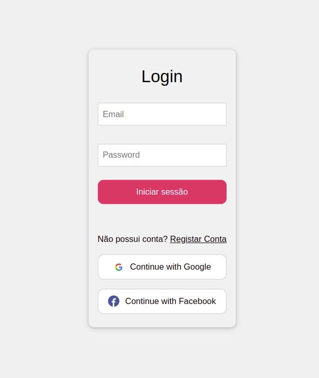

# Engenharia web - Base de dados de acordãos

## **Autores**
Gonçalo Duarte Lopes Marinho Gonçalves, A90969  
Henrique Almeida Vaz, A95533 

## **Introdução**
Este relatório surge no âmbito da Unidade Curricular de Engenharia Web, em que nos foi proposto a concepção de uma aplicação *Web* de gestão e consulta de acórdãos.

### **Objectivos**
Na implementação desta aplicação *Web*, pretendemos atingir os seguintes objectivos:

- Criar uma interface *web* que possibilite a navegação em toda a informação disponibilizada.
- Permitir que a aplicação possibilite a criação, edição e remoção de acórdãos.
- Implementar um sistema de pesquisa robusto que permita encontrar facilmente os registos pretendidos.
- Permitir aos utilizadores guardar na sua conta os acórdãos que considerem relevantes para si (os seus favoritos).
- Construir uma taxonomia de termos a partir dos descritores dos acórdãos.

## **Tratamento dos *datasets***

1. Uniformização de campos escritos de forma diferente, mas com o mesmo significado (por exemplo, "Magistrado" e "Relator").
2. Eliminação de campos vazios (sem valores).
3. Eliminação de caracteres anormais (\t,\n) nos campos onde existiam.
4. Remoção de campos que estavam com formato errado (casos em que o texto integral tambem estava separado em campos), mantendo nestes casos apenas o texto integral.
5. Remoção de descritores inválidos.
6. Remoção da variável booleana que por vezes indicava a existencia do texto integral.

## **Base de dados**

A base de dados (mongodb) construída para a nossa aplicação contém 4 coleções: acordaos, tribunais, users e campos.

A coleção `acordaos` contém todos os acordãos do sistema.

A coleção `tribunais` contém as siglas de cada tribunal e o respetivo nome para que seja possível através da sigla obter o nome e vice-versa.

A coleção `users` contém a informação dos utilizadores, informação de autenticação e os favoritos de cada utilizador.

A coleção `campos` serve dois propósitos, com ela é possivel saber quais são os campos dos acordãos que são obrigatórios (para estes é necessário garantir que o utilizador os introduz) de forma dinâmica, é também usando esta coleção que fazemos a associação entre os nomes dos campos sem caracteres especiais e os nomes com estes caracteres (por ex: dataAcordao->Data do Acordão).

De forma a simplificar o máximo possível a execução da nossa aplicação, é incluido neste repositório um dump da base de dados separado em ficheiros binários de 40MB (o git não permite ficheiros maiores). O nosso compose irá utilizar este dump para criar uma nova base de dados.

## **Servidor de Autenticação**
O servidor de autenticação é responsável pela gestão dos utilizadores, criação de novas contas, autenticação dos utilizadores na aplicação, adição e remoção de favoritos.

No servidor de autenticação é criado o ***token*** (*jsonwebtoken*) sempre é feito um registo ou *login*. Esse *token* irá ficar guardado num *cookie* no *browser* do utilizador para que depois seja usado em todos os pedidos feitos pelo mesmo.

### **Rotas**

- `GET /`: Devolve a lista de todos os utilizadores existente (apenas acessível para administradores).
- `POST /registar`: Cria um novo utilizador e devolve um token.
- `GET /login/facebook`: Efetua o login com a conta do Facebook.
- `GET /login/facebook/callback`: Rota de callback para o login com Facebook e que devolve o token.
- `GET /login/google`: Efetua o login com a conta do Google.
- `GET /login/google/callback`: Rota de callback para o login com a conta Google e que devolve o token.
- `GET /:id/favoritos`: Devolve a lista de favoritos do utilizador passado na rota. 
- `GET /:id`: Devolve a informação do utilizador passado na rota (para que possa consultar o seu perfil). 
- `POST /login`: Devolve um token caso o utilizador já tenha conta criada.
- `PUT /:id`: Atualiza os dados do utilizador passado na rota.
- `DELETE /:id`: Apaga os dados do utilizador passado na rota (apenas pode ser usada pelo próprio user ou por um administrador).
- `POST /registaradmin`: Rota para registo de um administrador (apenas pode ser usada por outro administrador).
- `POST /:id/favoritos`: Adiciona um novo acordão aos favoritos do utilizador passado na rota.
- `DELETE /:id/favoritos/:favoritoId`: Apaga o acordão com id passado na rota dos favoritos do utilizador.

## **API**

- `GET /acordaos/descritores`: Devolve a lista dos descritores existentes (a rota também recebe o número da página na interface e o número de elementos por página para que seja possível fazer paginação).
- `GET /acordaos/search`: Devolve todos os acordãos correspondentes à pesquisa efetuada. A rota pode receber uma *query string* com diversos campos existentes nos acordãos. 
- `GET /acordaos/count`: Devolve o número de acordãos correspondentes à pesquisa efetuada anteriormente.
- `GET /acordaos/:id`: Devolve o acordão com o id passado na rota.
- `POST /acordaos/`: Adiciona um novo acordão ao sistema (apenas um administrador pode aceder a esta rota),
- `PUT /acordaos/:id`: Atualiza os dados do acordão passado na rota (apenas um administrador pode aceder a esta rota).
- `DELETE /acordaos/:id`: Apaga os dados do acordão passado na rota (apenas um administrador pode aceder a esta rota).

- `GET /campos/`: Devolve todos os campos existentes na coleção.
- `POST /campos/`: Adiciona um novo campo.
- `PUT /campos/:id`: Atualiza os dados do campo passado na rota.
- `DELETE /campos/:id`: Remove os dados do campo passado na rota.

- `GET /tribunais/`: Devolve os nomes de todos os tribunais.
- `POST /tribunais/`: Adiciona um novo tribunal.
- `PUT /tribunais/:id`: Atualiza o nome do tribunal passado na rota.
- `DELETE /tribunais/:id`: Remove os dados do tribunal passado na rota.

## **Interface**
- `GET /`: Rota redireciona para o Login.
- `GET /logout`: Rota remove o token das cookies e redireciona para o Login.
- `GET /login`: Rota de login que renderiza a página para o utilizador inserir os dados, caso esta rota seja acedida por um utilizador que já tenha um token válido este é redirecionado para a Home.
- `POST /login`: Quando o utilizador submete os seus dados de Login para o servidor de interface, este recebe os dados e envia-os ao servidor de autenticação. O servidor de autenticação irá validar o acesso do utilizador com os dados na base de dados e responderá com um *token*.
- `GET /registar`: Rota de registo que renderiza a página para o utilizador inserir os dados para uma nova conta.
- `POST /registar`: Quando o utilizador submete os seus dados de Registo para o servidor de interface, este recebe os dados e envia-os ao servidor de autenticação. O servidor de autenticação irá criar a nova conta de utilizador com os dados e responderá com um *token*.
- `GET /registar/admin`: Rota de registo de administradores que renderiza a página onde um administrador pode criar novos administradores.
- `POST /registar/admin`: Quando o administrador submete os dados de Registo para o servidor de interface, este recebe os dados e envia-os ao servidor de autenticação. O servidor de autenticação irá criar a nova conta de administrador com estes dados.
- `GET /home`: Rota que renderiza a home page, esta rota mostra todos os acordãos existentes na base de dados (usa paginação).
- `GET /acordaos/adicionar`: Rota que renderiza o form para adicionar um novo acordão.
- `POST /acordaos/adicionar`: Rota que envia os dados introduzidos no form da Interface para a API para que sejam inseridos na base de dados.
- `POST /acordaos/adicionar/from-file`: Rota que envia os dados introduzidos através de um ficheiro no form da Interface para a API para que sejam inseridos na base de dados.
- `GET /acordaos/remover/:id`: Rota que faz um DELETE na api do acordão passado nos parametros.
- `GET /acordaos/editar/:id`: Rota que renderiza um acordão existente para permitir a sua edição.
- `POST /acordaos/editar/:id`: Rota que faz um PUT na api para alterar os dados do acordão na base de dados.
- `GET /acordaos/:id`: Rota que renderiza os dados do acordão passado nos parametros.
- `GET /acordaos/download/:id`: Rota que faz o download do acordão passado nos parametros.
- `POST /users/:id/favoritos`: Rota que adiciona um acordão aos favoritos fazendo um POST para o servidor de autenticação.
- `POST /users/:id/favoritos/:acordaoId/delete`: Rota que remove um acordão dos favoritos fazendo um DELETE para o servidor de autenticação.
- `POST /search`: Rota que realiza uma pesquisa com base nos critérios fornecidos e retorna os resultados.
- `GET /search`: Rota que renderiza a página de pesquisa de acórdãos, populando a lista de tribunais e que exibe os resultados se os critérios de busca forem fornecidos.
- `GET /perfil`: Rota que solicita os dados do utilizador que fez a solicitação.
- `POST /perfil`:  Rota em que o servidor de interface envia ao servidor de autenticação os novos dados de um utilizador para serem atualizados.
- `GET /perfil/delete`: Rota que remove o perfil do utilizador que faz a solicitação.
- `GET /users`: Rota que permite ao administrador consultar todos os utilizadores registados.
- `GET /users/remover/:id`: Rota que permite ao administrador remover um dado utilizador do sistema.
- `GET /taxonomia`: Rota que devolve uma taxonomia dos descritores.
- `GET /login/google`: Rota que redireciona o utilizador para o endpoint da autenticação da Google.
- `GET /login/google/callback`: Rota utilizada como ponto de retorno após a autenticação que trás os dados do mesmo em caso de sucesso.
- `GET /login/facebook`: Rota que redireciona o utilizador para o endpoint da autenticação da Meta.
- `GET /login/facebook/callback`: Rota utilizada como ponto de retorno após a autenticação que trás os dados do mesmo em caso de sucesso.
- `GET /favoritos`: Rota que renderiza os acórdãos selecionados como favoritos e o comentário que o utilizador lhes associou.
- `GET /tribunais`: Rota responsável por mostrar ao utilizador todos os tribunais registados no sistema.
- `GET /tribunais/adicionar`: Rota que permite ao administrador abrir uma página para poder introduzir os campos necessários para o registo de um novo tribunal.
- `POST /tribunais/adicionar`: Rota que permite ao administrador adicionar um novo tribunal à base de dados.
- `GET /tribunais/remover/:id`: Rota que permite ao administrador remover um tribunal da base de dados.

## **Demonstração do sistema**

### **Registo de conta**
Na página de registo de conta é pedida a informação do utilizador para criar nova conta. Caso já exista uma conta com o email inserido é mostrado um erro ao utilizador.

### **Login**
Na página de login o utilizador pode inserir os dados da sua conta (caso já tenha uma) ou escolher criar uma nova conta. Pode também optar por fazer o login com a conta do Facebook ou Google.

### **Home**
A página home é onde aparecem todos os acordãos listados. Esta página é diferente para os utilizadores normais e para os administradores, enquanto os utilizadores apenas conseguem consultar os acordãos os administradores também têm as opções de os editar e remover. Os administradores podem também adicionar novos acordãos. Nesta e nas restantes páginas onde são apresentados acórdãos é feita a paginação dos mesmos, sendo apresentados 25 acórdãos de cada vez.

Página Home de um utilizador

Página Home de um Administrador

  

### **Consultar um acordão**
Na consulta dos acordãos os utilizadores têm as opções de adicionar o acordãos aos favoritos e de fazer Download do acordão. Para os administradores há também aqui a opção de apagar e editar o acordão.

Consulta de acordão por um utilizador

  

Consulta de acordão por um Administrador

  

### **Adicionar um acordão**
Os administradores podem adicionar novos acordãos. De acordo com a informação da coleção `campos`, são mostrados alguns campos de preenchimento obrigatório, para os restantes campos opcionais existe um menu em que é possível adicionar mais campos ao acordão. É também possível adicionar acordãos via ficheiro, sendo que é feita a validação dos campos obrigatórios e o utilizador é notificado caso falte algum campo.

  

### **Editar um acordão**
Na página de edição de um acordão o administrador tanto pode editar os dados já existentes como também adicionar novos campos ao acordão através de um menu semelhante ao de criar um acordão.

  

### **Tribunais**
Na página dos tribunais é feita uma listagem de todos os tribunais existentes, sendo que quando o utilizador clica num tribunal é reencaminhado para a página de pesquisa onde é feita uma pesquisa de todos os acordãos pertencentes a esse tribunal.

  

Ao clicar no Tribunal da Relação do Porto o utilizador é redirecionado para a página da imagem abaixo.

  

### **Taxonomia**
Na página da taxonomia é apresentada uma taxonomia de descritores, o utilizador pode também pesquisar por keywords de forma a filtrar os termos apresentados. Clicando num dos descritores o utilizador é reencaminhado para a página de pesquisa onde é feita uma pesquisa por todos os acordãos que incluam esse descritor. Nesta página é também feita páginação para aumento de performance.

 

### **Favoritos**
Na página de favoritos o utilizador pode consultar e apagar os favoritos existentes.

 

### **Perfil**
Na página de perfil é possível que os utilizadores e administradores alterem a informação do seu perfil, é também mostrada a data do ultimo acesso e a data de criação de conta (que não podem ser alteradas). É também possível que o utilizador/administrador apague aqui a sua conta. Ao apagar a conta o token é removido da cookie e a sessão é terminada.

 

### **Pesquisa**
Na página de pesquisa é possível pesquisar acordãos por Autor, Descritor, Magistrado e autor, é também possível pesquisar por qualquer combinação destes.

 

### **Adicionar admin**
Para os administradores, na navbar existe um botão para adicionar novos administradores.

 

### **Consultar utilizadores**
Os administradores têm também a opção de consultar todas as contas existentes no sistema e de remover as contas que desejarem. Caso o utilizador apague a sua própria conta o token é removido das cookies e a sessão terminada.

 

## **Conclusão**
Em suma, criámos uma interface web intuitiva que permite a navegação completa pela informação disponibilizada, proporcionando uma interação amigável e eficiente para os utilizadores. Esta interface foi concebida para ser fácil de utilizar, com uma disposição clara e lógica que facilita a utilização mesmo para quem não tenha grandes conhecimentos técnicos. Implementámos funcionalidades robustas para a criação, edição e remoção de acórdãos, permitindo que os administradores giram os dados de forma eficaz e sem complicações. Desenvolvemos também um sistema de pesquisa avançado que facilita a localização de acórdãos específicos através de diversos critérios, como autor, tribunal, magistrado e descritor, garantindo que os utilizadores consigam encontrar rapidamente a informação de que necessitam. Além disso, a funcionalidade de favoritos permite aos utilizadores guardar acórdãos relevantes, proporcionando uma maneira conveniente de aceder rapidamente aos documentos mais importantes para eles. A construção de uma taxonomia de descritores dos acórdãos melhorou significativamente a organização e acessibilidade dos dados, tornando a navegação ainda mais intuitiva.

A implementação de um servidor de autenticação garantiu a segurança dos dados dos utilizadores, utilizando tokens JWT para autenticação e gestão de sessões. Este sistema de autenticação foi desenhado para ser seguro e eficiente, protegendo a privacidade dos utilizadores e assegurando que apenas utilizadores autorizados podem aceder à informação sensível. Durante o desenvolvimento, enfrentámos vários desafios, incluindo a integração entre os diferentes serviços (interface, API e autenticação), o tratamento e limpeza dos datasets para garantir a qualidade e consistência dos dados na base de dados, e a implementação de um sistema de autenticação robusto para proteger os dados dos utilizadores.

O desenvolvimento desta aplicação é um ponto de partida para futuras melhorias e expansões. Possíveis desenvolvimentos incluem a introdução de novas funcionalidades que atendam às necessidades dos utilizadores, a otimização da performance da aplicação para lidar com grandes volumes de dados e o contínuo aprimoramento das práticas de segurança para proteger os dados dos utilizadores. Pretendemos continuar a evoluir esta aplicação, incorporando feedback dos utilizadores e integrando novas tecnologias para melhorar ainda mais a experiência do utilizador.

## **Correr o projeto**
`git clone git@github.com:Vaz7/EngWebTrabalho2024.git`

No caso de na raiz do repositório não existir uma pasta chamada dump o seu download pode ser feito [aqui](https://mega.nz/file/k3VUxaKa#69zGOknHC27HI62GRsi0mXGzUNIzld0HZJ8MSglOxB4).

Após efetuar o download basta extrair o zip para a raiz do projeto e seguir as restantes instruções.

Executar os comandos:

`cd EngWebTrabalho2024`

`sudo docker-compose up --build`

Existe já criada uma conta de administrador com Email: `admin` e Password: `12345`. Para testar com uma conta normal basta fazer um novo registo de utilizador.

Os datasets já tratados podem ser encontrados [aqui](https://mega.nz/folder/InMRjDhb#VrFvMV202_nSia_TCIGaXg).